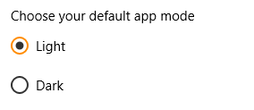

# WindowsThemeListener
[](https://www.nuget.org/packages/WindowsThemeListener/) [](https://www.buymeacoffee.com/willykimura)

**WindowsThemeListener (WTL)** is a library that listens to all modern Windows theming and color settings. With this nifty library, your .NET applications can now easily employ the current Windows theme mode and accent colors as applied across all modern Windows Operating Systems.

<div align="center">


</div>

# Installation 

To install via the [NuGet Package Manager](https://www.nuget.org/packages/WindowsThemeListener/) Console, run:

> `Install-Package WindowsThemeListener`

# Features
- Supports [.NET Framework 4.0](https://www.microsoft.com/en-us/download/details.aspx?id=17718) and above, [.NET Core 3.1](https://dotnet.microsoft.com/download/dotnet-core/3.1) and [.NET 5.0](https://dotnet.microsoft.com/download/dotnet/5.0).
- Silently monitors Windows personalization settings in the background.
- Listens to the default App mode and Windows mode theming options.
- Listens to the Windows primary accent color changes.
- Supports accent forecolor generation based on accent color changes.
- Supports enabling/disabling theme monitoring at runtime.
- Super easy API for integrating with .NET applications.

# Usage
To begin with, once you've installed the library, ensure you import the namespace `WK.Libraries.WTL`:

```c#
using WK.Libraries.WTL;
```

Windows Theme Listener is a static library so no need for instantiation:

```c#
ThemeListener.Enabled = true;                             // Allow listening to settings' changes.
ThemeListener.ThemeSettingsChanged += OnThemeSettingsChanged;  // Setup a settings event listener.

private void OnThemeSettingsChanged(object sender, ThemeListener.ThemeSettingsChangedEventArgs e)
{
    // You can query for the following settings:
    // -----------------------------------------
    // e.AppMode
    // e.TransparencyEnabled
    // e.AccentColor
    // e.AccentForeColor
    
    // For example...
    if (e.AppMode == ThemeModes.Light) 
    {
        // Switch app to light mode.
    }
    else if (e.AppMode == ThemeModes.Dark) 
    {
        // Switch app to dark mode.
    }
}
```

If you would like to know which theme options were changed, use the `OptionsChanged` list event argument:

```c#
private void OnThemeSettingsChanged(object sender, ThemeListener.ThemeSettingsChangedEventArgs e)
{
    if (e.SettingsChanged.Contains(ThemeListener.ThemeSettings.AppMode)) 
    {
        // The App Theme Mode was changed.        
    }
    
    if (e.SettingsChanged.Contains(ThemeListener.ThemeSettings.AccentColor)) 
    {
        // The Windows Theme Mode was changed.
    }
}
```

As seen, the `OptionsChanged` property is of a list type, defined as: `List<ThemeOptions>`. The `ThemeOptions` is an enumeration that exposes all supported theming options in the library.

You can also access the theming options manually using the related properties:

```c#
var appMode = ThemeListener.AppMode;                    // Get the App theme mode.
var winMode = ThemeListener.WindowsMode;                // Get the Windows theme mode.
bool transparent = ThemeListener.TransparencyEnabled;   // Get the Windows transparency.
Color accentColor = ThemeListener.AccentColor;          // Get the Windows accent color.
Color accentForeColor = ThemeListener.AccentForeColor;  // Get the accent forecolor.
```

The `WindowsMode` property is only available starting with [Windows 10 build 18282](https://blogs.windows.com/windows-insider/2018/11/14/announcing-windows-10-insider-preview-build-18282/). As for other previous releases, the `WindowsMode` property inherits from the `AppMode` property.

The `AccentForeColor` is an internally generated color that is based on the accent color applied. This generally means that whenever the accent color changes, a contrasting foreground color that blends well with the accent color background is generated and provided.

You can also generate a custom accent forecolor using the method `GenerateAccentForeColor([Color accentColor])`:

```c#
// Get a custom accent forecolor.
Color foreColor = ThemeListener.GenerateAccentForeColor(Color.Khaki);
```

To enable or disable listening to setting changes, simply set the property `Enabled` to `true` or `false` respectively:

```c#
// Disable listening to settings changes.
ThemeListener.Enabled = false;
```

However, you can still access the theme settings directly using their respective properties:

```c#
var appMode = ThemeListener.AppMode;
Color accentColor = ThemeListener.AccentColor;
```

To change the interval with which Windows Theme Listener uses to poll for changes made to the theme settings, use the `Interval` property:

```c#
// Set a custom interval for checking setting changes (unit in milliseconds).
ThemeListener.Interval = 20000; // 20000 = 20secs.
```

## Windows Theming Explainer

Windows provides two standard theme modes, *Dark* and *Light*. Starting with [Windows 10 build 18282](https://blogs.windows.com/windows-insider/2018/11/14/announcing-windows-10-insider-preview-build-18282/), we have a new theme setting called **Windows mode** which themes the Start menu, Taskbar and Action Center.

*Let's see what each option does:*

- The `AppMode` property references the **App mode** setting and is applied across various Windows and third-party applications, e.g. [UWP Apps](https://docs.microsoft.com/en-us/windows/uwp/get-started/universal-application-platform-guide) such as Skype:

  

- The `WindowsMode` property references the **Windows mode** setting and themes the Start menu, Taskbar and Action Center:

  


> ***Note:***
>
> As indicated before, the `WindowsMode` option is only available starting with [Windows 10 build 18282](https://blogs.windows.com/windows-insider/2018/11/14/announcing-windows-10-insider-preview-build-18282/). As for other previous releases, the `WindowsMode` property inherits from the `AppMode` property. 
>
> You can only view the two options once you change the default color to **Custom**:
>
> 
>
> However, choosing either `Light` or `Dark` will set the default theme for both the `AppMode` and  the `WindowsMode` properties:
>
> 

- The `TransparencyEnabled` property setting targets applications that support Windows' transparency feature, e.g. [UWP Apps](https://docs.microsoft.com/en-us/windows/uwp/get-started/universal-application-platform-guide). Likewise if your .NET application supports transparency to some degree, feel free to reference it:

  

- The `AccentColor` references the Windows accent color applied:

  

As noted before, the `AccentForeColor` is an internally generated color that is based on the accent color applied.

## Targeting Windows versions

WTL also comes packaged with a helper class, `OS`, that lets you check the Windows version it's being run on. This is because Windows 7 and lower do not support the theming options provided in Windows 8 and higher.

To check the Windows version being run, simply use the property `OS.Version`:

```c#
int ver = OS.Version;
// Returns: 10 for Windows 10, 8 for Windows 8, 7 for Windows 7...
```

You can also choose to inform your users and/or disable theming whenever your app is running on Windows 7 and lower:

```c#
if (OS.Version >= 8) // If Windows 8 and higher...
{
    // Your code here.
}
```

# Donate

If you love my projects and would like to support me, consider donating via [BuyMeACoffee](https://www.buymeacoffee.com/willykimura). All donations are optional and are greatly appreciated. 🙏

*Made with* 💛 *by* [*Willy Kimura*]([https://github.com/Willy-Kimura)